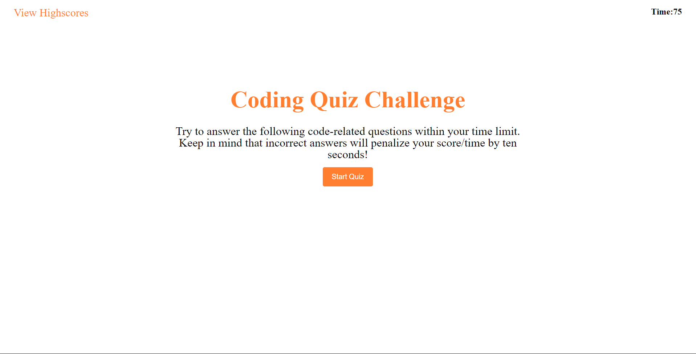

# Module-4-Challenge

## Description

My goal with this project was to build an online quiz that would be timed and would score you based on how fast you answered the questions. I bult this project to test my abilites on using functions, using intervals to display and remove objects,and adding event listeners. By building this quiz I would be using all of these elements together for the first time.

Working on this project has taught a better understanding on the importance of variable naming conventions, how event listeners work and how you would have to troubleshoot to get them working properly, its taught me how difficult using local storage can be and why its integral to the function of many web applications.

## Installation

What are the steps required to install your project? Provide a step-by-step description of how to get the development environment running.

## Usage
How it's supposed to be used is; you click on the start button, then a multiple choice quiz appears. If you click on the correct answer, the word "correct!" will appear and take you to the next question. If you do not click on the correct answer, the word "wrong!" appears and will deduct 10 seconds from the timer, and you will not be able to move on until you answer the correct answer. Once you have completed all the answers it will the take you to a screen in which you input your intials and those intials and your score will be viewable when you click "View High Scores".

## License
Check LICENSE in the repo.
---